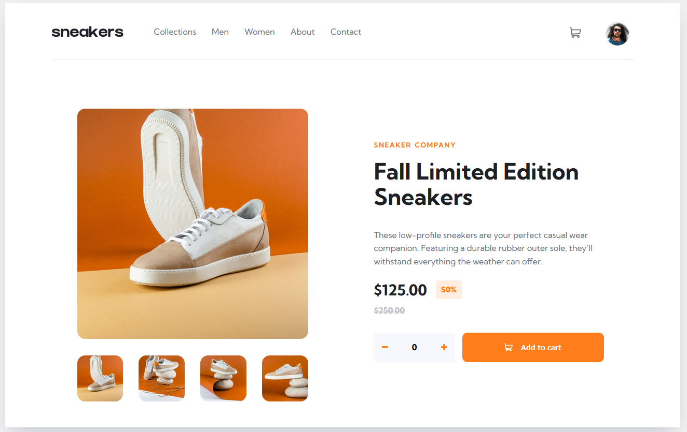

# Frontend Mentor - E-commerce product page solution

This is a solution to the [E-commerce product page challenge on Frontend Mentor](https://www.frontendmentor.io/challenges/ecommerce-product-page-UPsZ9MJp6). Frontend Mentor challenges help you improve your coding skills by building realistic projects.

## Table of contents

- [Overview](#overview)
  - [The challenge](#the-challenge)
  - [Screenshot](#screenshot)
  - [Links](#links)
  - [Built with](#built-with)
  - [What I learned](#what-i-learned)

## Overview
During the development of this image gallery project, I found that the real challenge lay in managing the shopping cart component. Specifically, ensuring that it remained hidden and properly positioned when the other two components—the easy box and the side menu—were displayed. Achieving this delicate balance required thoughtful JavaScript functions and meticulous attention to detail.

### The challenge

Users should be able to:

- see 4 views of the page depending on their screen size
- See hover states for all interactive elements on the page
- Open a lightbox gallery by clicking on the large product image
- Switch the large product image by clicking on the small thumbnail images
- Add items to the cart
- View the cart and remove items from it

### Screenshot

### Links

- Solution URL: [Add solution URL here](https://your-solution-url.com)
- Live Site URL: [Add live site URL here](https://your-live-site-url.com)

### Built with

- Semantic HTML5 markup
- CSS custom properties
- Flexbox
- CSS Grid
- vanila javascript
- pure structured css

### What I learned

During the development process, I encountered several transitions used throughout the page. To enhance user experience, I delved into adding transitionend event listeners to specific elements. This allowed for seamless transitions between different states, particularly in the image gallery section and the mobile side menu. These components presented more complex functionalities that needed to interact harmoniously with other elements on the page, including the page cover.

One achievement I’m particularly proud of is my solution for the image gallery. By adding minimal code, I transformed it into a versatile lightbox. It’s rewarding to see how small adjustments can make a big impact!

